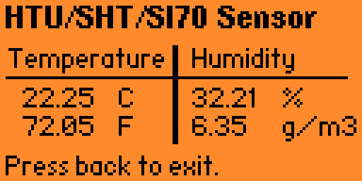

# Flipper Temperature Sensor - HTU21D / SI7021

## What is this?

A small app for the [Flipper Zero](https://flipperzero.one) that reads the [I2C](https://en.wikipedia.org/wiki/I%C2%B2C) signal from a HTU21D or Si7021 sensor and displays the current temperature and humidity.

I'm using a [Sparkfun HTU21D sensor](https://learn.sparkfun.com/tutorials/htu21d-humidity-sensor-hookup-guide), also tested with a clone and with the Si7021 variant.

## How to Connect the sensor

## How to install

If you have the FAP loader, just copy the fap file from the Releases into your Flipper apps folder and you should be able to launch it from the menu.

If you don't have the FAP loader you will have to bake this application together with your firmware (aka compile it all together).

## How to compile

Place the temperature_sensor folder in the applications_user folder and compile using FBT.

Please refer to the [Flipper Build Tool documentation](https://github.com/flipperdevices/flipperzero-firmware/blob/dev/documentation/fbt.md).

## Which Flipper versions was this app tested on?

- 0.67.2
- 0.68.1
- 0.68.2-1007-RM

## I can't build the app together with the firmware?

In the application.fam, don't forget to change the apptype, it should not be EXTERNAL but APP.